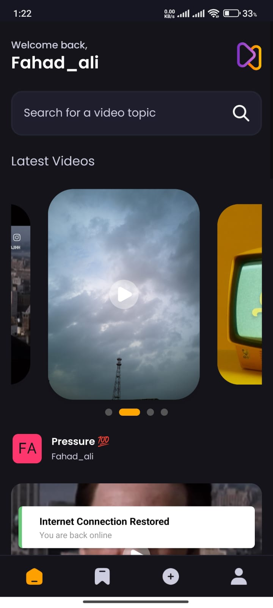
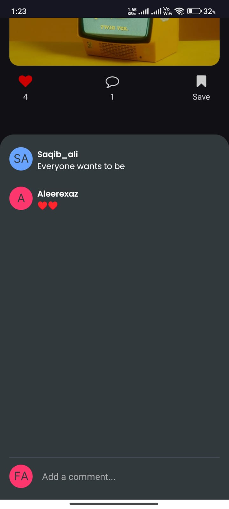

# Social Video App  

An intuitive social video app built with Expo React Native. The app allows users to sign in, sign out, sign up, view profiles, upload videos, like, comment, save videos, and perform seamless searches. 

## Table of Contents  
- [Screenshots](#screenshots)  
- [Features](#features)  
- [Setup](#setup)  
- [Usage](#usage)  
- [Technology Used](#technology-used)  
- [Author](#author)  

# Screenshots
Home Screen	


Upload Video	


Profile Management	


Saved Videos


Comments



---

## Features  
- **Authentication**: Sign in, sign up, and sign out functionality.  
- **Profile Management**: View and edit your profile with ease.  
- **Video Sharing**: Upload, like, comment, and save videos.  
- **Search**: Search through uploaded and saved videos seamlessly.  
- **Intuitive Design**: A user-friendly interface for a great experience.  

---

## Setup  

### Step 1: Install Prerequisites  
Ensure you have the following installed on your system:  
- **Node.js**: [Download here](https://nodejs.org/)  
- **Expo CLI**: Install using `npm install -g expo-cli`  
- **Appwrite**(https://appwrite.io/): For backend services  

### Step 2: Clone the Repository  
Clone this repository and navigate to the project directory:  
```bash  
git clone https://github.com/fahad7169/Aora1.git  
cd Aora1
```

### Step 3: Set Up Environment Variables
1: Create a ```.env``` file in the root directory.

2: Add your Appwrite API keys to the file:Create same as .env.example

### Step 4: Set Up Appwrite Database
1: Log in to [Appwrite](https://appwrite.io/) and create a new project.
2: Create a database with the following collections and attributes:
#### Collections:
1: **savedVideos**
* ```videoId``` (Relationship with ```videos``` collection; many-to-one)
* ```userId``` (Relationship with ```users``` collection; many-to-one)

2: **comments**

* ```title``` (String)
* ```videoId``` (Relationship with ```videos``` collection; many-to-one)
* ```userId``` (Relationship with ```users``` collection; many-to-one)

3: **likes**

* ```videoId``` (String)
* ```userId``` (String)

4: **videos**

* ```title``` (String)
* ```thumbnail``` (URL)
* ```prompt``` (String)
* ```video``` (URL)
* ```creator``` (Relationship with users collection; many-to-one)

5: **users**

* ```username``` (String)
* ```email``` (Email)
* ```avatar``` (URL)
* ```accountId``` (String)


### Step 5: Install Dependencies
Install all required dependencies:

```bash
npm install
```
  
### Step 6: Start the App
Run the app using Expo:

```bash
npx expo start
```

## Usage
1: Launch the app on an emulator or real device.
2: Sign in or sign up to create an account.
3: Explore the app's features:
* Upload videos with thumbnails and prompts.
* Like, comment on, and save videos.
* Seamlessly search through all or saved videos.


## Technology Used
This app was built using the following libraries:

* (React native)[https://reactnative.dev/]
* (Expo)[https://docs.expo.dev/tutorial/create-your-first-app/]
* (Appwrite)[https://appwrite.io/]

## Author
This project was developed by Fahad. Contributions, suggestions, and feedback are welcome!


